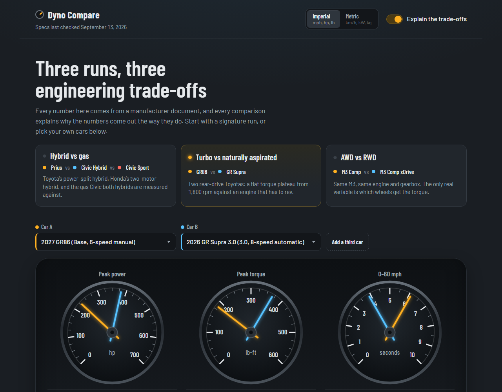

# Dyno Compare

Compare two or three cars side by side on a dashboard-style instrument cluster, read the raw numbers on a dyno-printout spec sheet, and get a plain-language explanation of the engineering trade-offs behind them.

**[Live Demo](DEMO_LINK_PLACEHOLDER)**



Every figure comes from a manufacturer document and links to it. Where a maker doesn't publish a number, the site shows **unverified** instead of estimating one.

## What's on the page

- **Three signature runs** load first, each isolating one trade-off:
  - **Hybrid vs gas:** Toyota Prius vs Honda Civic Sport Hybrid vs Honda Civic Sport. Toyota's power-split e-CVT, Honda's two-motor system, and the gas car both are measured against. The write-up covers regenerative-brake blending, what "e-CVT" means mechanically, and battery management, from a hybrid-diagnostics point of view.
  - **Turbo vs naturally aspirated:** Toyota GR86 vs GR Supra 3.0. A flat turbo torque plateau from 1,800 rpm against an engine that has to rev.
  - **AWD vs RWD:** BMW M3 Competition vs M3 Competition M xDrive. Same engine and gearbox; the drivetrain is the variable.
- **Pick any 2 or 3 cars** from 18 current US-market models (Toyota-heavy, plus performance and EV benchmarks).
- **Radial gauges** for peak power, peak torque and 0–60, one needle per car on a shared dial.
- **Units toggle:** imperial (mph, hp, lb, lb-ft) or metric (km/h, kW, kg, N·m).
- **Explain the trade-offs toggle:** on shows the generated explanations; off leaves the gauges and raw spec sheet.
- **Shareable links:** the URL always encodes the comparison on screen, e.g.
  `?cars=toyota-gr86,toyota-gr-supra&units=metric`
- **Mobile-first layout:** gauges stack into compact rows and the spec sheet reflows to one car per column.

## Tech stack

Plain HTML, CSS and JavaScript (ES modules), with no framework, build step or runtime dependencies. Gauges are hand-built SVG. Fonts are Barlow and Barlow Condensed from Google Fonts. The site is hosted on GitHub Pages.

## Data methodology

- **Market and years:** US-spec, the latest model year each manufacturer lists (2025–2027).
- **Sources:** Toyota.com full specification pages, Honda News spec releases, BMW Group PressClub USA, MazdaUSA.com, Ford.com and Ford's technical specifications, HyundaiUSA.com. Every value in [`js/data.js`](js/data.js) carries an index into that car's source list, and the tests fail if one doesn't.
- **0–60 times** are manufacturer claims and are labeled that way. Many makers (Honda, Mazda, Ford, and Toyota for most non-GR models) don't publish one; those show as unverified rather than borrowing a magazine figure.
- **Torque on electrified cars** is shown as published and marked: Toyota publishes engine-only torque for its hybrids, Honda publishes traction-motor torque, and Toyota lists the bZ's two motors separately. Those needles are dashed, and nothing is summed that wasn't meant to be.
- **Two caveats, stated in the UI too:** Toyota's pressroom and Ford's spec PDF block automated reading, so the bZ 0–60 claim and the Mustang curb weights were read from those documents' search-indexed text.
- **Last checked:** 13 September 2026 (the `CHECKED` constant, shown in the header and footer).

## Unit conversions

All data is stored in US units exactly as published and converted in one place, [`js/units.js`](js/units.js):

| Conversion | Factor |
| --- | --- |
| mph → km/h | × 1.609344 (exact) |
| hp → kW | × 0.745699872 (mechanical/SAE hp) |
| lb → kg | × 0.45359237 (exact) |
| lb-ft → N·m | × 1.3558179483 |

The test page checks these against reference values: **60 mph = 96.6 km/h** and **300 hp = 224 kW**. It also cross-checks derived figures against numbers Toyota publishes itself (GR Supra 8.89 lb/hp; GR Corolla 0.091 hp/lb).

## Run it locally

It's a static site with no build step and no dependencies. Serve the folder with any static server (ES modules don't load from `file://`):

```bash
npx serve .
```

Then open `http://localhost:3000`. Open `/tests.html` to run the tests in the browser.

## Project structure

```
index.html        page shell
css/styles.css    cockpit + dyno-paper styling
js/data.js        18 cars, per-figure sources, signature runs, CHECKED date
js/units.js       conversions and derived figures (power-to-weight, average g)
js/state.js       URL <-> state
js/gauges.js      SVG instrument gauges
js/tradeoffs.js   explanation generator + signature essays
js/app.js         rendering and controls
tests.html        browser test runner (js/tests.js)
```

## About

Built by [Ayman Khayat](https://www.linkedin.com/in/ayman-khayat-350b4b335), mechanical engineering student, drawing on a Toyota dealership internship in hybrid powertrain diagnostics.

MIT licensed.
